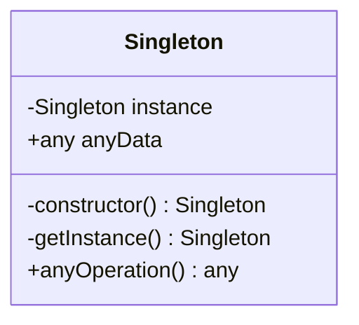

# Singleton

## Intenção:

Garantir que uma classe tenha somente uma instância no programa e fornecer um ponto de acesso global para a mesma.

## Somente uma instância?

- Geralmente usado para acesso a recursos compartilhados, como acesso à base de dados, interfaces gráficas, sistemas de arquivos, servidores de impressão e mais.
- Também usado para substituir variáveis globais, como em casos de uso de objetos de configuração do sistema como um todo.

## Ponto de acesso global?

- Você pode permitir acesso global ao Singleton em toda sua aplicação, assim como fazíamos com variaveis globais.
- Uma vantagem do Singleton é que podemos proteger a instância, com encapsulamento, evitando que outro código sobrescreva seu valor.

## Estrutura:

- **instance**: Atributo privado para a instância.
- **anyData**: Qualquer dado necessário para o Singleton.
- **<<constructor>>**: Construtor privado, não permite o uso de 'new' com o Singleton.
- **getInstance()**: Getter para instance - aqui decidimos se criamos uma nova instância ou retornamos a instância já criada.
- **anyOperation()**: Quaisquer métodos necessários para o Singleton.

## Aplicabilidade:

- Use o Singleton quando uma classe precisa ter somente uma instância disponivel em todo seu programa.
- Use o Singleton quando perceber que está usando variáveis globais para manter partes importantes do programa, como variáveis de configuração que são usadas por toda a aplicação.

## Consequências:

### Boas:

- Acesso controlado à instância única.
- É fácil permitir um número maior de instâncias caso mude de ideia.
- Usa lazy instantiation, o Singleton só é criado no momento do uso.
- Substitui variáveis globais.

### Ruins:

- É mais dificil de testar.
- Viola o principio da responsabilidade única (SOLID).
- Requer tratamento especial em casos de concorrência.
- Erich Gamma (autor) descreveu que este seria o único padrão que ele removeria se fosse refatorar o livro.
