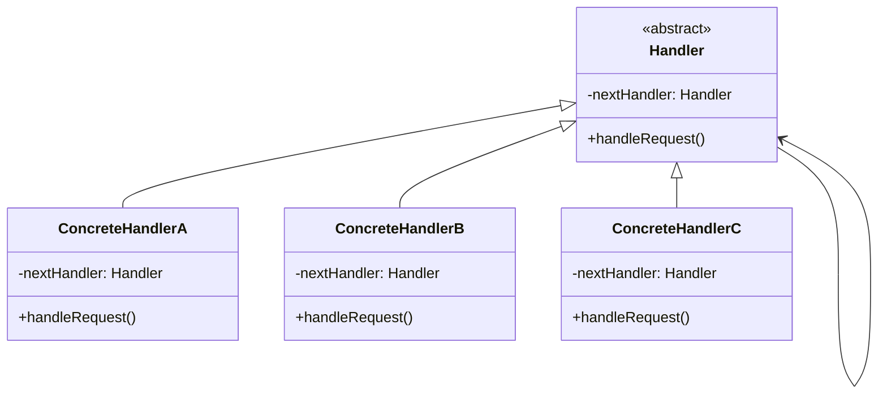

# Chain of Responsibility

## Intenção Oficial

Evita o acoplamento do remetente de uma solicitação ao seu destinatário, dando a mais de um objeto a chance de tratar a solicitação. Encadeia os objetos receptores e passa a solicitação ao longo da cadeia até que um objeto a trate.

## Sobre o Chain of Responsibility

- É usado quando uma requisição precisa passar por uma sequência de operações até ser totalmente tratada.
- Desacopla quem envia de quem vai tratar a requisição.
- É muito usado com requisições HTTP.
- É a base para outros padrões de projeto conhecidos (como Middleware usado no express).
- Permite que um objeto TRATE a requisição e chame o PRÓXIMO objeto da cadeia.
- Permite que um objeto NÃO TRATE a requisição e chame o PRÓXIMO objeto da cadeia.
- Permite que um objeto TRATE a requisição e FINALIZE a cadeia.
- Permite que um objeto NÃO TRATE a requisição e FINALIZE a cadeia.
- O cliente pode iniciar a requisição de qualquer objeto caso necessário.

## Estrutura

## Aplicabilidade

Use o Chain of Responsibility quando:
- Seu sistema precisa processar uma requisição em várias etapas diferentes e você não quer criar uma ordem rígida para o processamento. O chain of responsibility permite que você altere a ordem dos objetos na cadeia facilmente (mesmo assim, mantendo uma ordem específica).
- Você quer aplicar o princípio da responsabilidade única para tratamento de dados da requisição. Cada objeto fica responsável por tratar apenas a parte que lhe couber.
- Você quer permitir que os objetos responsáveis pelo tratamento de requisição possam variar em tempo de execução.

## Consequências

### Boas:

- Aplica o princípio da responsabilidade única (SRP).
- Aplica o princípio do aberto e fechado (OCP).
- Permite que você altere a cadeia de objetos e a ordem das chamadas facilmente.

### Ruins:

- É comum uma requisição passar por toda a cadeia e não ser tratada.
