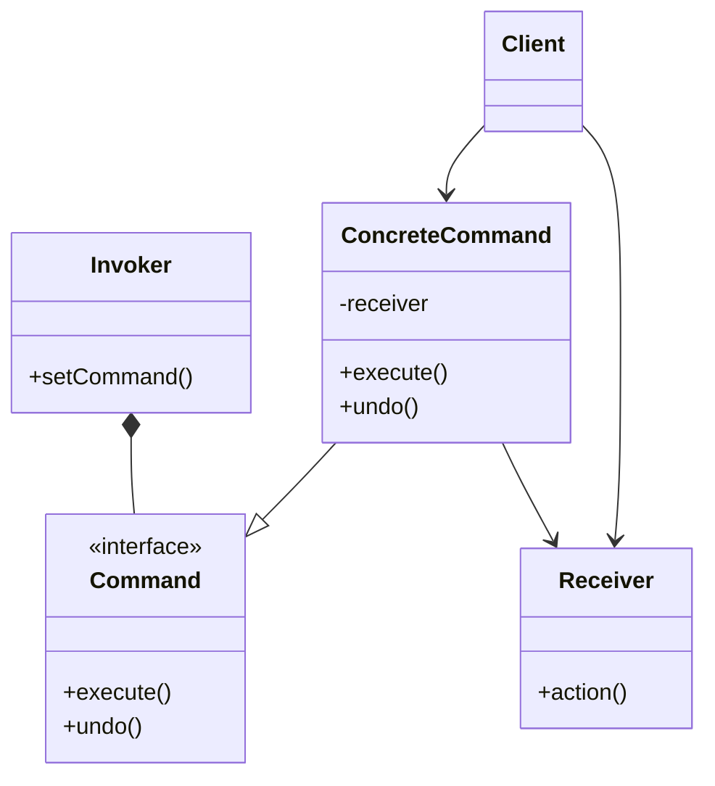

# Command

## Intenção Oficial

Encapsular uma solicitação como um objeto, desta forma permitindo que você parametrize clientes com diferentes solicitações, enfileire ou registre (log) solicitações e suporte operações que podem ser desfeitas.

## Sobre o Command

- Transforma uma solicitação (um comando) em um objeto com toda a informação necessária para sua execução.
- É a versão orientada a objetos para funções de callback.
- Permite que comandos possam ser enfileirados, armazenados ou desfeitos.
- Permite registro de alterações para que possam ser replicadas quando necessário.
- Permite que você crie comandos compostos.
- Desacopla o código do objeto que faz a solicitação com o objeto que recebe a solicitação.
- Usa a composição ao invés da herança.

## Estrutura

## Aplicabilidade

Use o Command quando:
- Você quer desacoplar o objeto que envia a solicitação do objeto que a receberá.
- Você quer tratar um comando como um objeto (com a possibilidade de armazenar, agendar, enfileirar, fazer log, agendar execuções, ou fazer qualquer coisa que pode ser feita com um objeto).
- Você quer permitir que solicitações possam ser feitas e desfeitas.

## Consequências

### Boas:

- Você pode criar comandos simples e complexos (ou até compostos de outros comandos).
- Você pode implementar fazer e desfazer.
- Comandos são objetos normais, portanto podem fazer tudo que objetos normais fazem.
- Desacopla o objeto que envia do objeto que recebe a solicitação.

### Ruins:

- Muitas classes podem tornar o sistema mais complexo.
