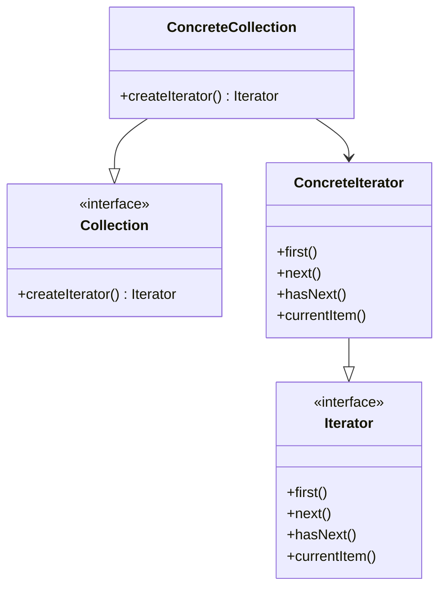

# Iterator

## Intenção Oficial

Fornece uma maneira de acessar sequencialmente os elementos de um objeto agregado sem expor sua representação subjacente.

## Sobre o Iterator

- Desacopla a intenção principal do objeto do modo como a sua iteração é realizada (delega a iteração para outro objeto).
- Permite vários tipos de iterators, facilitando a implementação de novos modos de travessia na mesma coleção.
- Encapsula os detalhes e monitora toda a travessia.
- Permite que a coleção troque de iterador em tempo de execução.
- Geralmente a linguagem de programação disponibiliza maneiras para trabalhar com iteradores.

## Estrutura

## Aplicabilidade

Use o Iterator quando:
- Você precisa remover a complexidade de travessia de dentro da coleção principal. Isso permite que sua coleção foque apenas em armazenar dados de maneira eficiente.
- Sua coleção pode ter vários modos de travessia, como crescente, decrescente, pelo menor número de saltos, pulando de dois em dois, ou como preferir.
- Você quer disponibilizar protocolos de travessia para diferentes tipos de coleções.

## Consequências

### Boas:

- É possível pausar a travessia e continuar posteriormente.
- É possível atravessar várias vezes a mesma coleção em paralelo usando outro objeto iterador.
- É fácil adicionar novos objetos iteradores com algoritmos de travessia completamente diferentes.
- Não polui o código do objeto principal com vários métodos e algoritmos de travessia diferentes.

### Ruins:

- Este padrão só é útil se sua coleção realmente precisar de uma travessia complexa. Do contrário é apenas complexidade a mais.
