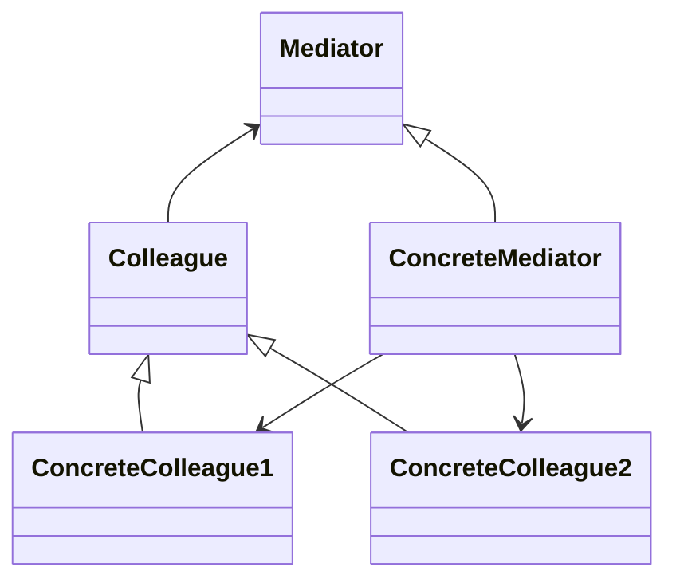

# Mediator

## Intenção Oficial

Define um objeto que encapsula como um conjunto de objetos interage. O mediator promove o acoplamento fraco ao evitar que os objetos se refiram explicitamente uns aos outros, permitindo que você varie suas intenções.

## Sobre o Mediator

- Visa encapsular a comunicação direta entre objetos.
- Desacopla objetos que estariam intimamente ligados.
- Centraliza toda a comunicação em apenas um objeto.

## Estrutura

## Aplicabilidade

Use o Mediator quando:
- Você quer diminuir ou extinguir o acoplamento direto entre as classes que poderiam estar diretamente acopladas.
- Você quer simplificar comunicações de muitos-para-muitos para comunicações um-para-muitos.

## Consequências

### Boas:

- Desacopla objetos que poderiam estar firmemente acoplados.
- Facilita a reutilização de objetos.
- Facilita a adição de novos mediadores e classes participantes na comunicação.
- Encapsula a comunicação entre objetos.

### Ruins:

- É fácil criar um mediator "faz tudo" (god class).
