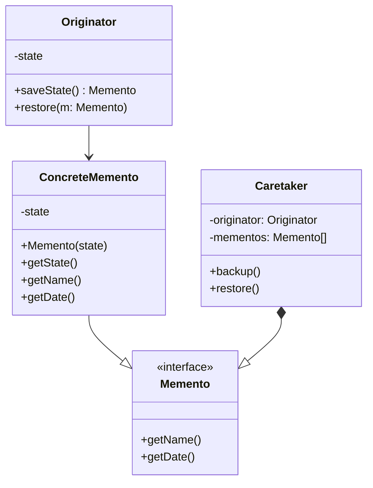

# Memento

## Intenção Oficial

Sem violar o encapsulamento, captura e externaliza um estado interno de um objeto, de modo que o mesmo possa posteriormente ser restaurado para este estado.

## Sobre o Memento

- Praticamente todas as aplicações o implementam com a função "desfazer" (CTRL+Z).
- Desacopla a responsabilidade da classe originadora de tomar conta dos seus backups.
- Garante o encapsulamento e consistência nos backups.

## Estrutura

## Aplicabilidade

Use o Memento quando:
- Você quer ter a possibilidade de salvar e restaurar o estado atual de um objeto sem violar o encapsulamento.
- Você deseja implementar a função "desfazer" no seu sistema.
- Você deseja fazer backups de estado de determinadas classes no seu sistema.

## Consequências

### Boas:

- Desacopla a responsabilidade de tomar conta do backup da classe original.
- É fácil salvar e restaurar um backup de uma classe.

### Ruins:

- Quanto mais backups, maior o consumo de memória da sua aplicação.
- As classes zeladoras precisam acompanhar as mudanças nas classes originadoras.
- Pode ser desafiador garantir o encapsulamento em algumas linguagens de programação.
