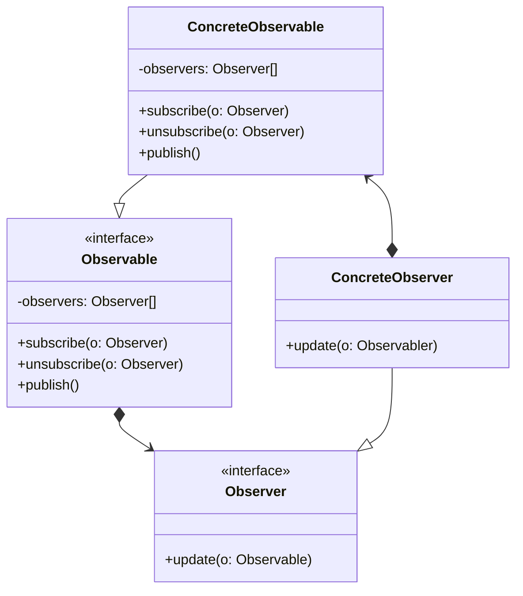

# Observer

## Intenção Oficial

Define uma dependência um para muitos entre objetos, de modo que, quando um objeto muda de estado, todos os seus dependentes são automaticamente notificados e atualizados.

## Sobre o Observer

- Implementado com dois tipos de objetos: objetos observáveis (Observable) e objetos observadores (Observer).
- Objetos observáveis (Observable) têm uma referência para todos os seus observadores. Isso torna possível adicionar, remover e notificar todos observadores quando seu estado muda.
- Objetos observadores (Observer) devem ter meios de receber notificação de seus Observáveis. Geralmente isso é feito com apenas um método.

## Estrutura

## Aplicabilidade

Use o Observer quando:
- Você precisa notificar vários objetos sobre a mudança de estado de outro(s) objeto(s).

## Consequências

### Boas:

- Usa o SRP e OCP.
- Facilita a comunicação entre objetos em tempo de execução.

### Ruins:

- Pode ser complexo ou impossível manter a ordem em que as notificações são enviadas.
