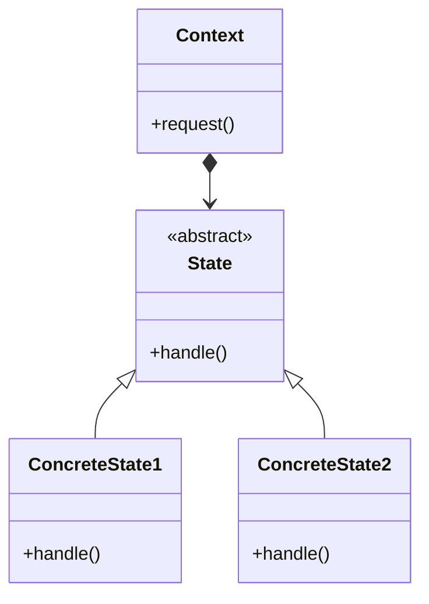

# State

## Intenção Oficial

Permite que um objeto altere seu comportamento quando seu estado interno muda. O objeto parecerá ter mudado sua classe.

## Sobre o State

- Evita condicionais quando um objeto contexto muda de comportamento dependendo do seu estado.
- Desacopla o estado de um objeto contexto e seus métodos em objetos de estado separados.
- Facilita a adição de novos estados sem a necessidade de alterar estados anteriores.

## Estrutura

## Aplicabilidade

Use o State quando:
- O seu objeto pode se comportar de maneira diferente dependendo do seu estado atual.
- Você quer evitar o uso de condicionais que alteram o comportamento da classe de acordo com valores dos seus campos.

## Consequências:

### Boas:

- Desacopla a lógica de um estado da classe de contexto.
- Permite a criação de novos estados apenas adicionando novas classes.
- Elimina condicionais complexas da classe de contexto.

### Ruins:

- Se você tem apenas poucas condicionais simples, aplicar este padrão pode deixar o seu código mais complexo do que o necessário.

