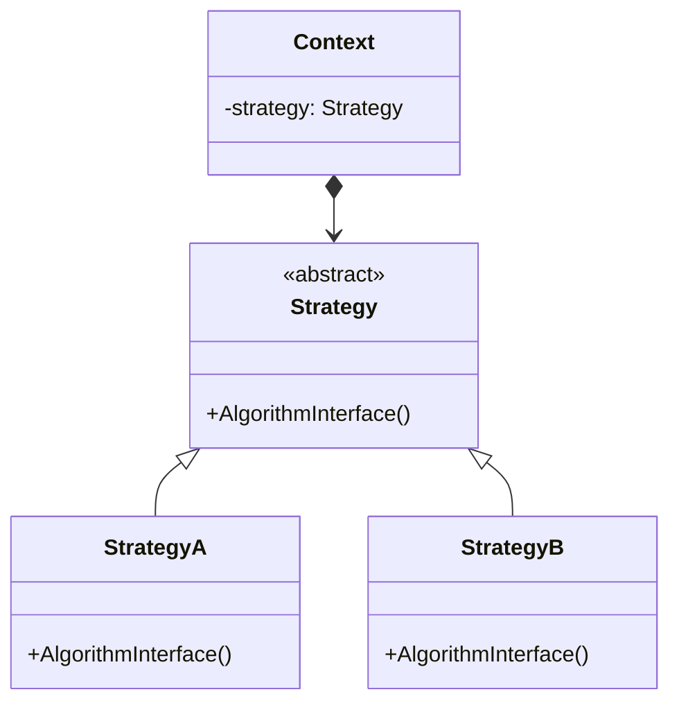

# Strategy

## Intenção Oficial

Definir uma família de algoritmos, encapsular cada um deles e fazê-los intercambiáveis. O strategy permite que o algoritmo varie independentemente dos clientes que o utilizam.

## Sobre o Strategy

- Separa a regra de negócio de variações de algoritmos que possam existir.
- Define uma família de algoritmos cada uma com uma variação diferente.
- Usa composição para permitir a troca de algoritmos em tempo de execução.
- Permite a criação de vários algoritmos sem a necessidade de condicionais.

## Estrutura

## Aplicabilidade

Use o Strategy quando:
- Você tiver variantes de um mesmo algoritmo e precisa trocar esses algoritmos em tempo de execução.
- Você precisa isolar a regra de negócio do algoritmo que deve ser aplicado (aplicando o princípio da responsabilidade única).
- Você perceber que está usando condicionais apenas para trocar o resultado final de um algoritmo.

## Consequências

### Boas:

- Troca herança por composição.
- Separa a regra de negócio de algoritmos complexos.
- Aplica os princípios do aberto/fechado e da responsabilidade única.

### Ruins:

- Pode ser complexo criar toda uma hierarquia de classes para aplicar novos algoritmos.
- Você pode obter o mesmo resultado com funções caso a linguagem de programação permitir.
- O código cliente precisa conhecer as estratégias que vai usar.

