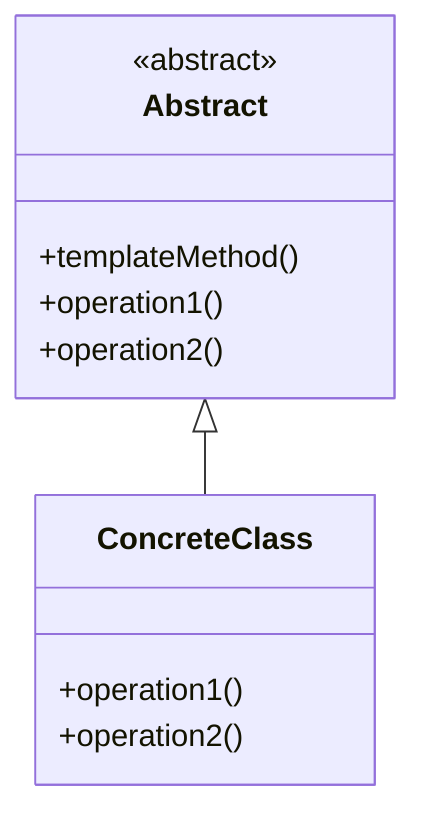

# Template Method

## Intenção Oficial

Define o esqueleto de um algoritmo em uma operação, postergando a definição de alguns passos para subclasses. O template method permite que as subclasses redefinam certos passos de um algoritmo sem mudar sua estrutura.

## Sobre o Template Method

- Mantém a ordem de chamada de métodos do algoritmo.
- Evita a duplicação de código dentro da classe base.
- Substitui condicionais por polimorfismo.
- Permite que as subclasses alterem apenas os passos necessários para concluir o algoritmo.
- Permite a adição de hooks para que as subclasses utilizem em pontos estratégicos do algoritmo.

## Estrutura

## Aplicabilidade

Use o Template Method quando:
- Você precisa de variações de um mesmo algoritmo sem mudar a ordem de execução dos métodos.
- Você percebe que está usando herança para alterar apenas pequenos trechos de código de um algoritmo.

## Consequências

### Boas:

- Evita duplicação de código.
- Permite fácil alteração de algoritmos.
- Aplica o OCP e SRP.

### Ruins:

- Em alguns casos pode violar o LSP ao alterar o comportamento de métodos nas subclasses.

