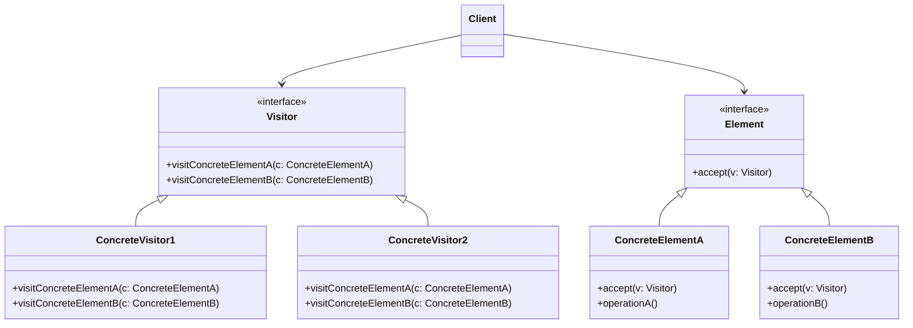

# Visitor

## Intenção Oficial

Representa uma operação a ser executada sobre os elementos da estrutura de um objeto. O visitor permite que você separe um algoritmo dos elementos sobre os quais opera.

## Estrutura

## Aplicabilidade

Use o Visitor quando:
- Você precisa executar um algoritmo em todos os elementos de uma estrutura mais complexa (como uma estrutura criada com o padrão Composite).
- Você quer separar uma lógica complexa em objetos auxiliares.

## Consequências

### Boas:

- Limpa o código da regra de negócio.
- Separa algoritmos complexos em objetos auxiliares.
- Aplica SRP e OCP.

### Ruins:

- Se um novo objeto for adicionado à estrutura, você precisará atualizar os objetos visitantes.
- Objetos visitantes podem não ter acesso a todos os membros dos objetos em que operam.
