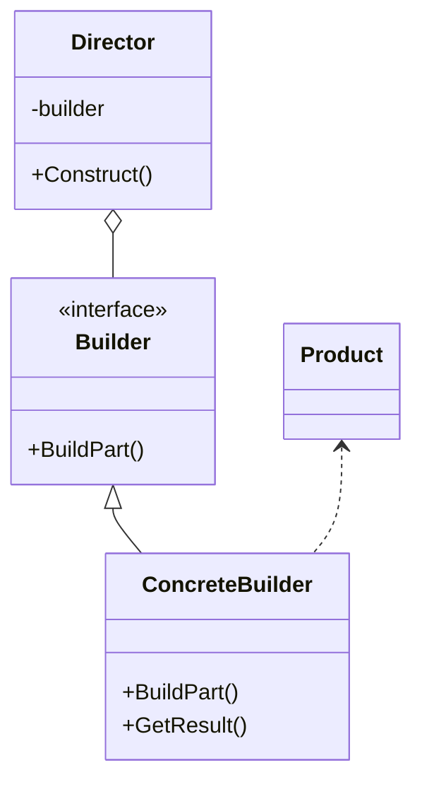

# Builder

## Intenção oficial

Separar a construção de um objeto complexo da sua representação de modo que o mesmo processo de construção possa criar diferentes representações.

## Visão geral do Builder

- O padrão sugere a separação do código que cria e o código que usa o objeto.
- Trata da criação de objetos complexos:
    - Construtores muito complexos.
    - Composição de vários objetos (composite).
    - Algoritmo de criação do objeto complexo.
- Permite a criação de um objeto em etapas.
- Permite method chaining.
- O objeto final pode variar de acordo com a necessidade.
- É um padrão complexo.

## Estrutura

- **Builder**: Define a interface de todos os objetos "Builder". As etapas de construção em comum são definidas aqui.
- **ConcreteBuilder**: Builders concretos implementam a interface de acordo com a sua necessidade. Elas podem produzir produtos de tipos diferentes.
- **Product**: Os produtos finais são os objetos que o cliente deseja consumir. Eles não têm uma interface em comum porque podem ser de tipos diferentes.
- **Director**: A classe "Director" é opcional. Ela pode definir a ordem em que as etapas de construção dos objetos são executadas.

## Consequências

### Boas:

- Separa criação de utilização.
- O cliente não precisa criar objetos diretamente.
- O mesmo código pode construir objetos diferentes.
- Ajuda na aplicação dos princípios SRP (Single responsability principle) e OCP (Open closed principle).

### Ruins:

- O código final pode se tornar muito complexo.
