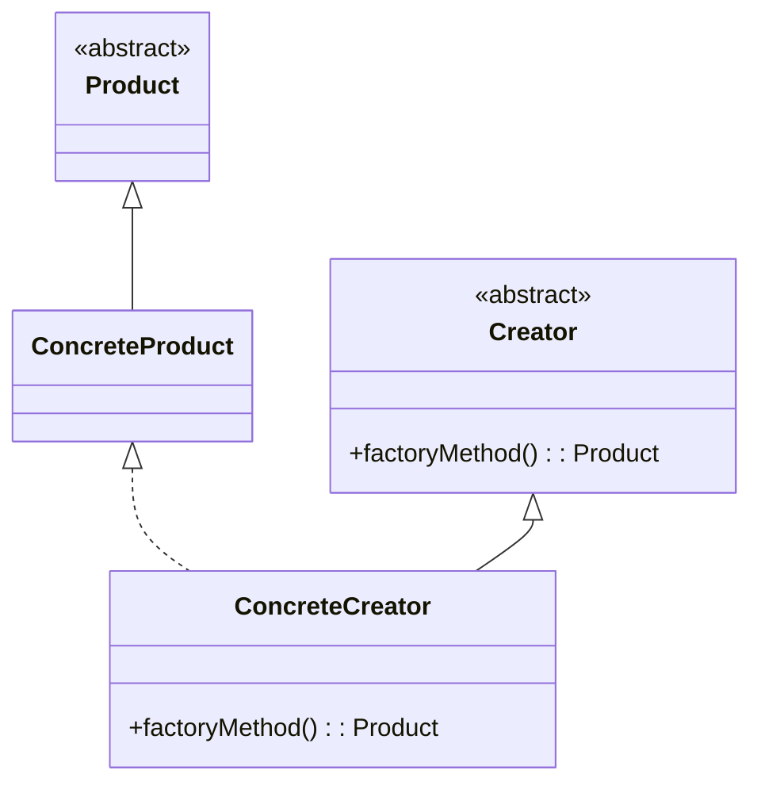

# Factory method

## Intenção oficial

Definir uma interface para criar um objeto, mas deixar as subclasses decidirem que classe instanciar. O Factory Method permite adiar a instanciação para as subclasses.

(Obs: Fábricas são simplesmente operações que criam objetos)

## Sobre o Factory Method

- É um padrão de projeto de criação (lida com a criação de objetos).
- Oculta a lógica de instanciação do código cliente. O método fábrica será responsável por instanciar as classes desejadas.
- É obtido através de herança. O método fábrica pode ser criado ou ser sobrescrito por subclasses.
- Dá flexibilidade ao código cliente permitindo a criação de novas factories sem a necessidade de alterar código já escrito (OCP).
- Pode usar parâmentros para determinar o tipo dos objetos a serem criados ou os parâmetros a serem enviados aos objetos sendo criados.

## Estrutura

- **Product**: Interface em comum para produtos finais. Classes que implementam o factory method devem retornar produtos que implementam essa interface.
- **ConcreteProduct**: Produtos concretos que serão retornados pelas classes que implementarem o factory method.
- **Creator**: Responsável pela criação de um factory method abstrato (também pode implementar um factory method). Essa classe pode e deve conter outros membros (métodos e atributos) para sua lógica interna.
- **ConcreteCreator**: A única responsabilidade dessas classes é implementar o factory method informando qual produto será retornado. Também pode implementar lógica para a criação de produtos.

## Aplicabilidade

- Use o factory method quando não souber com certeza quais os tipos de objetos o seu código vai precisar.
- Use o factory method para permitir a extensão de suas factories para criação de novos objetos (isso ajuda a aplicar o Open/Closed Principle).
- Use o factory method para desacoplar o código que cria, do código que usa as classes (Single Responsability Principle).
- Use o factory method para dar um hook (gancho) às subclasses para permitir que elas decidam a lógica de criação de objetos.
- Use o factory method para eliminar duplicação de código na criação de objetos.

## Consequências

### Boas:

- Ajuda a aplicar o Open/Closed Principle. Seu código vai estar aberto para extensão.
- Ajuda na aplicação do Single Responsability Principle. Separa o código que cria do código que usa o objeto.
- Ajuda no desacoplamento do seu código.

### Ruins:

- Se usado sem necessidade, pode causar uma explosão de subclasses. Será necessário uma classe ConcreteCreator para cada ConcreteProduct.

