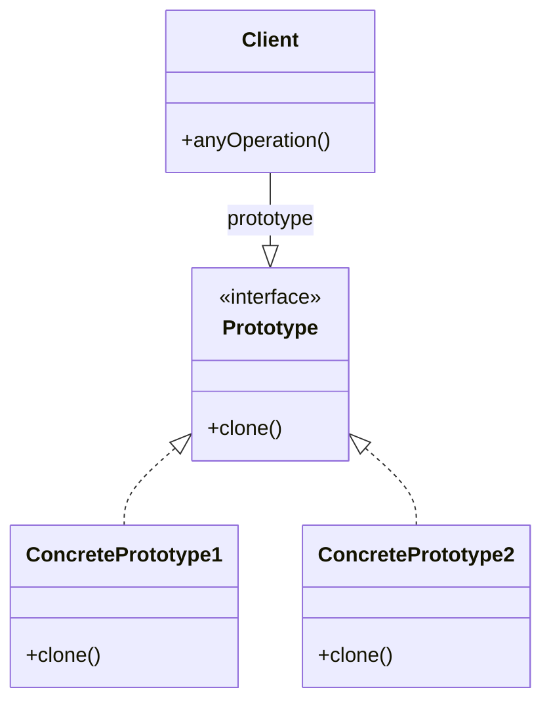

# Prototype

## Intenção oficial

Especificar os tipos de objetos a serem criados usando uma instância-protótipo e criar novos objetos pela cópia desse protótipo.

## Visão geral do padrão Prototype

- O tipo de objeto a ser criado é determinado pelo objeto protótipo.
- É tipicamente usado para evitar a recriação de objetos "caros".
- Ajuda a evitar a explosão de subclasses.
- Pode (ou não) manter um registro de objetos protótipo em um objeto separado.
- Geralmente é criado apenas com um método "clone" dentro do objeto protótipo.
- O método clone pode gerar uma "shallow" ou "deep" copy do objeto protótipo.
- Evita que o cliente conheça as classes que criam os objetos.

## Estrutura

- **Client**: O código cliente é o código fora da estrutura do Prototype. É o seu código que deseja clonar o objeto protótipo.
- **Prototype**: Uma interface para garantir que todos os objetos protótipo tem o método "clone".
- **ConcretePrototype1 - ConcretePrototype2**: São objetos protótipo.

## Aplicabilidade

- Use o padrão prototype quando precisar que seu código não dependa de classes concretas para a criação de novos objetos.
- Use o padrão prototype quando quiser evitar explosão de subclasses para objetos muito similares.
- Use o padrão prototype para evitar a recriação de objetos "caros".

## Consequências

### Boas:

- Oculta classes concretas no código cliente.
- Ajuda na criação de objetos caros ou complexos.
- Evita a explosão de subclasses.

### Ruins:

- Clonar objetos que tem referências para outros objetos pode ser super complexo.
