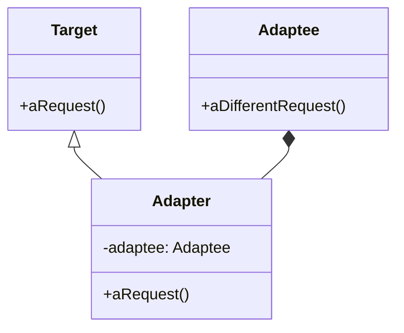

# Adapter

## Intenção oficial

Converter a interface de uma classe em outra interface esperada pelos clientes. O Adapter permite que certas classes trabalhem em conjunto, pois de outra forma seria impossível por causa de suas interfaces incompatíveis.

## Sobre o Adapter

- É um padrão da categoria estrutural (structural).
- Faz exatamente o que um adaptador da vida real faz (pense em um adaptador de tomadas de um formato para outro).
- É muito usado para definir limites dentro de camadas da aplicação.
- Também pode ser usado para adaptar interfaces de código legado para um novo código.

## Estrutura

## Aplicabilidade

Use o padrão Adapter quando:

- Você não quiser que seu código dependa diretamente de código de terceiros ou legado.
- Você quiser usar uma classe existente mas sua interface for incompatível com a interface que seu código ou domínio precisam.
- Você quiser reutilizar várias subclasses que não possuam determinada funcionalidade mas for impraticável estender o código de cada uma apenas para adicionar a funcionalidade desejada (o Decorador também faz isso).

## Consequências

### Boas:

- Desacopla o código da aplicação de códigos de terceiros.
- Aplica o SRP ao separar a conversão de interfaces da lógica da aplicação.
- Aplica o OCP ao permitir introduzir novos Adapters para código existente.

### Ruins:

- Aumenta a complexidade da aplicação (Por outro lado, qual outra solução deveria ser aplicada?).
