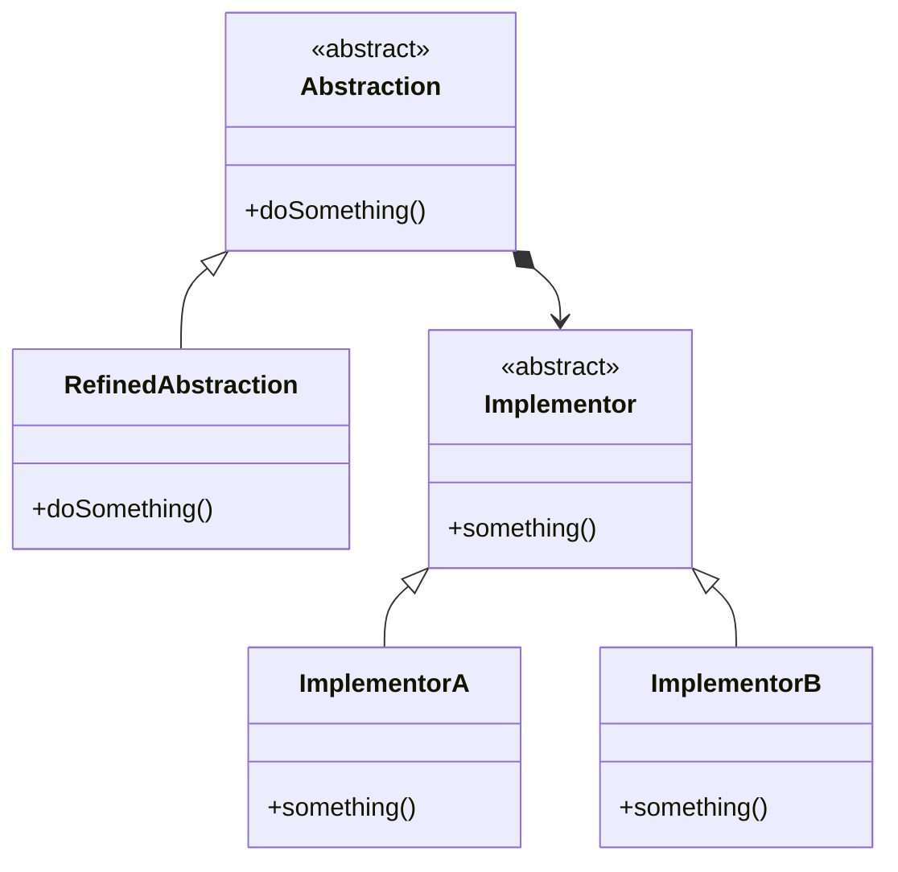

# Bridge

## Intenção oficial

Bridge é um padrão de projeto estrutural que tem a intenção de desacoplar uma abstração (é um código de alto nível que geralmente delega ações para outro objeto) da sua implementação (é o código que realmente faz o trabalho), de modo que as duas possam variar e evoluir independentemente.

## Estrutura

## Diferenças entre Bridge e Adapter

(GOF pág. 208) A diferença chave entre esses padrões está nas suas intenções... O padrão Adapter faz as coisas funcionarem APÓS elas terem sido projetadas; o Bridge faz funcionar ANTES QUE existam...

## Aplicabilidade

Use o padrão Bridge quando:
- Você souber que sua estrutura terá abstrações (código de alto nível) e implementações dessa abstração (detalhes) que possam variar de maneira independente.
- Você souber que o Adapter poderia ser aplicado naquela estrutura (você já conhece a estrutura).
- Você quiser dividir uma classe que possa ter diversas variantes (como em produtos e suas variações de cores: Caneta Azul, Caneta Vermelha, Camiseta Azul, Camiseta Vermelha, etc...).
- Você quer trocar as implementações em tempo de execução.

## Consequências

### Boas:

- Desacopla o código da abstração do código da implementação (SRP).
- Implementa o OCP ao permitir novas abstrações e/ou implementações para código existente.
- Tem as mesmas vantagens do Adapter.

### Ruin:

- Aumenta a complexidade da aplicação quando implementado em locais incorretos.
