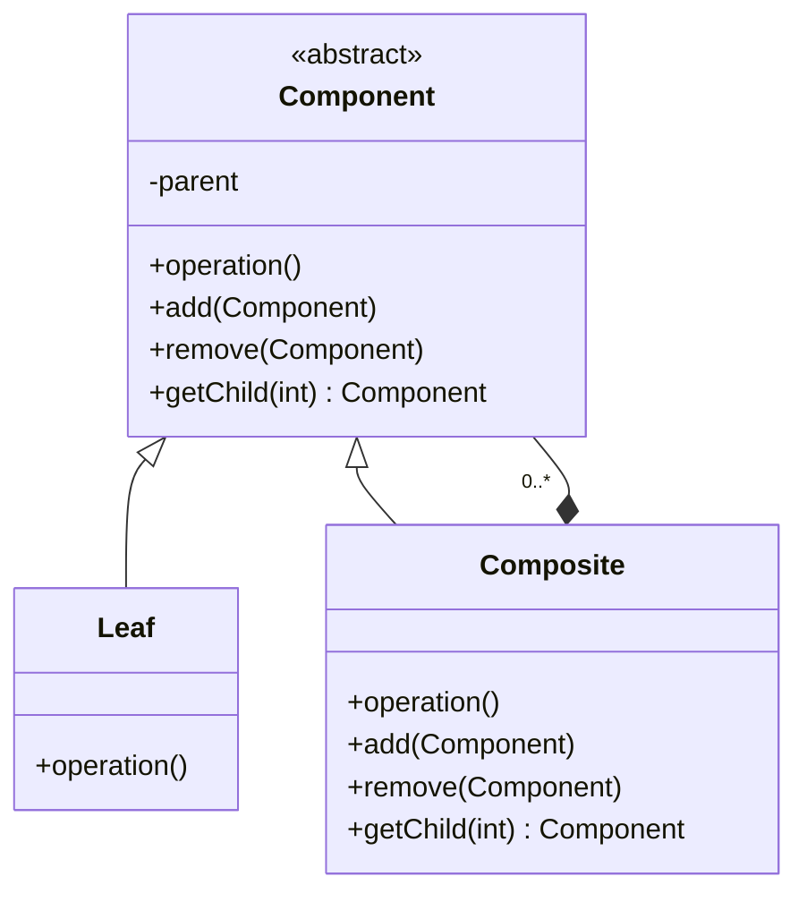

# Composite

## Intenção oficial

Compor objetos em estruturas de árvore para representar hierarquias partes/todo. Composite permite aos clientes tratarem de maneira uniforme objetos individuais e composições de objetos.

## Sobre o composite

- É um padrão da categoria estrutural (structural).
- Faz mais sentido em estruturas que podem ser tratadas hierarquicamente (como árvores).
- Pode ser uma solução para estruturas complexas que podem ser tratadas de maneira uniforme.
- Prioriza composição ao invés de herança.
- Exemplo: produto solto com preço e caixa com vários do mesmo produto também com preço.

## Estrutura

## Aplicabilidade

Use o padrão Composite quando:
- sua estrutura de objetos possa ser representada hierarquicamente, como por exemplo, estruturas do tipo árvore.
- você quiser que o código cliente trate objetos compostos e objetos simples da mesma maneira.

## Consequências

### Boas:

- É muito fácil criar objetos complexos por composição.
- É fácil gerar uma hierarquia de objetos.
- É fácil usar polimorfismo e recursão.
- É fácil adicionar novos tipos de elementos na estrutura (OCP).

### Ruins:

- Dependendo da estrutura, pode quebrar o princípio da segregação de interface (ISP). Objetos do tipo "Leaf" (folha) tendem a ter métodos que não usam ou não fazem nada.
