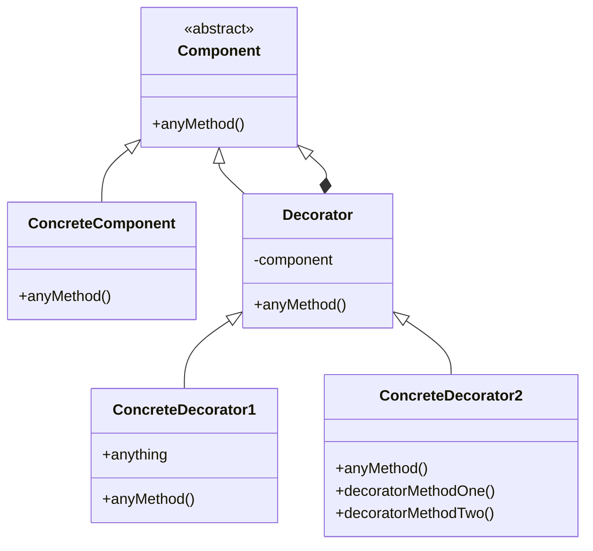

# Decorator

## Intenção oficial

Agregar responsabilidades adicionais a um objeto dinamicamente. Os Decorators fornecem uma alternativa flexível ao uso de subclasses para extensão de funcionalidades.

## Sobre o Decorator

- Usa a composição ao invés da herança (sempre prefira composição ao invés de herança).
- É muito parecido com o "Composite" porém tem a intenção diferente.
- É usado para adicionar funcionalidades a objetos em tempo de execução.
- Finge ser o objeto sendo decorado, porém repassa chamadas de métodos para o mesmo.
- Pode executar ações antes e depois das chamadas dos métodos do objeto decorado.
- Pode manipular dados antes do retorno.

## Estrutura

## Aplicabilidade

Use o padrão Decorator quando:
- Você precisa adicionar funcionalidades em objetos sem quebrar ou alterar o código existente.
- Você quiser usar composição ao invés de herança.
- Você percebe que pode ocorrer uma explosão de subclasses em determinada estrutura.

## Consequências

### Boas:

- Composição é melhor do que herança em grande maioria dos casos.
- É fácil adicionar ou remover comportamento de objetos sem tocar em código já escrito ou testado (OCP).
- É possível decorar um objeto já decorado, adicionando ainda mais funcionalidades (camadas).

### Ruins:

- Quanto mais decorators em camadas, mais complexo seu código se torna.
