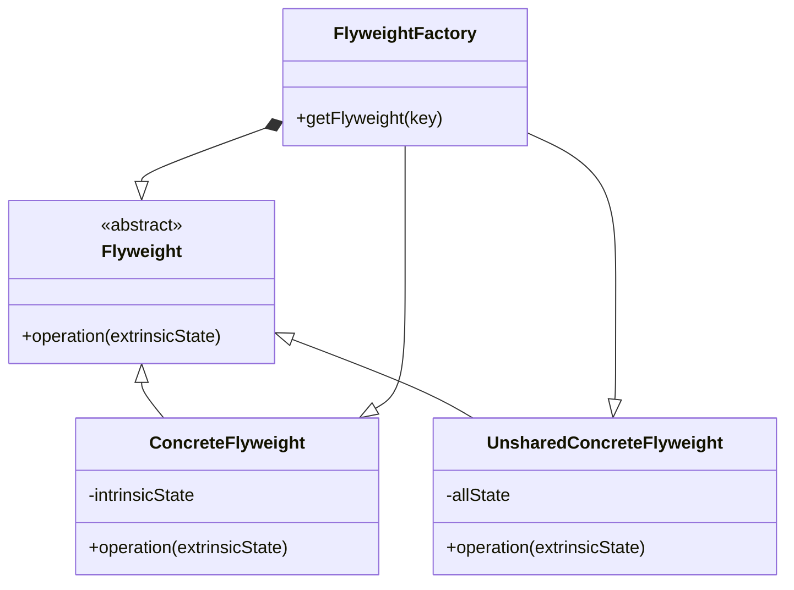

# Flyweight

## Intenção Oficial

Flyweight é um padrão de projeto estrutural que tem a intenção de usar compartilhamento para suportar eficientemente grandes quantidades de objetos de forma granular.

## Sobre o Flyweight

- É um padrão de otimização (cuidado)
- Visa economizar memória RAM devido ao grande número de objetos na aplicação.
- Resolve o problema de desempenho dividindo o estado do objeto em "intrínseco" e "extrínseco":
  - Estado intrínseco é o estado que geralmente não muda ou que muda muito pouco.
  - Estado extrínseco é o estado que pode ser movido para fora do objeto por mudar frequentemente.
- Só deve ser usado se sua aplicação estiver com problemas de alto consumo de memória RAM.

## Estrutura

## Aplicabilidade

Só use o Flyweight se TODAS as condições a seguir forem verdadeiras:
- Sua aplicação utiliza uma grande quantidade de objetos.
- Os custos de armazenamento são altos por causa da grande quantidade de objetos.
- A maioria dos estados de objetos podem se tornar extrínsecos.
- Muitos objetos podem ser substituídos por poucos objetos compartilhados.
- A aplicação não depende da identidade dos objetos.

## Consequências

### Boas:

- Pode economizar memória RAM.

### Ruins:

- Muito complexo.
