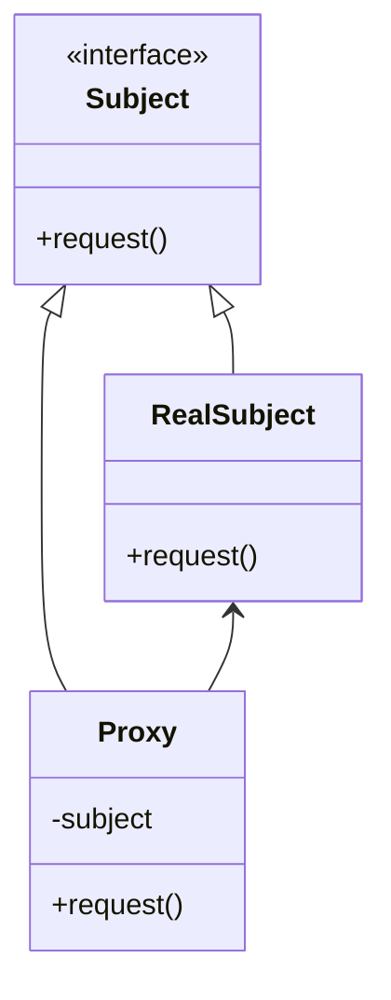

# Proxy

## Intenção Oficial

Proxy é um padrão de projeto que tem a intenção de fornecer um substituto ou marcador de localização para outro objeto para controlar o acesso a esse objeto.

## Sobre o Proxy

- Usa composição, portante tem a estrutura muito semelhante ao "Composite" e "Decorator" (as intenções são completamente diferentes).
- Usa um objeto "proxy" que finge ser o objeto real.
- É usado para controle de acesso, logs, cache, lazy instantiation e lazy evaluation, distribuição de serviços e mais.
- Pode escolher como e quando repassar chamadas de métodos para o objeto real.
- Pode executar ações antes e depois das chamadas dos métodos do objeto real.
- Tem várias variações: proxy virtual, proxy remoto, proxy de proteção, proxy inteligente...

## Variações de Proxy

- Proxy Virtual: controla acesso a recursos que podem ser caros para criação ou utilização.
- Proxy Remoto: controla acesso a recursos que estão em servidores remotos.
- Proxy de proteção: controla acesso a recursos que possam necessitar autenticação ou permissão.
- Proxy inteligente: além de controlar acesso ao objeto real, também executa tarefas adicionais para saber quando e como executar determinadas ações.

## Estrutura

## Aplicabilidade

Use o padrão Proxy quando:
- Você tem um objeto caro para ser criado e não quer permitir acesso direto a esse objeto (proxy virtual).
- Você quer restringir acesso a partes da sua aplicação (proxy de proteção).
- Você quer uma ligação entre seu sistema e um sistema remoto (proxy remoto).
- Você quer fazer cache de chamadas já realizadas (proxy inteligente ou proxy de cache).
- Você quer interceptar quaisquer chamadas de métodos no objeto real por qualquer motivo (por exemplo, criar logs).

## Consequências

### Boas:

- O código cliente nem precisa saber se está ou não usando um Proxy (ele finge ser o objeto real).
- Você pode adicionar novos Proxies sem mudar código já testado (OCP).
- O Proxy funciona mesmo se o objeto real não estiver operacional ou pronto para uso.
- Você pode controlar o ciclo de vida de objetos reais dentro do proxy.

### Ruins:

- Introduz mais classes ao sistema, isso o torna mais complexo.
